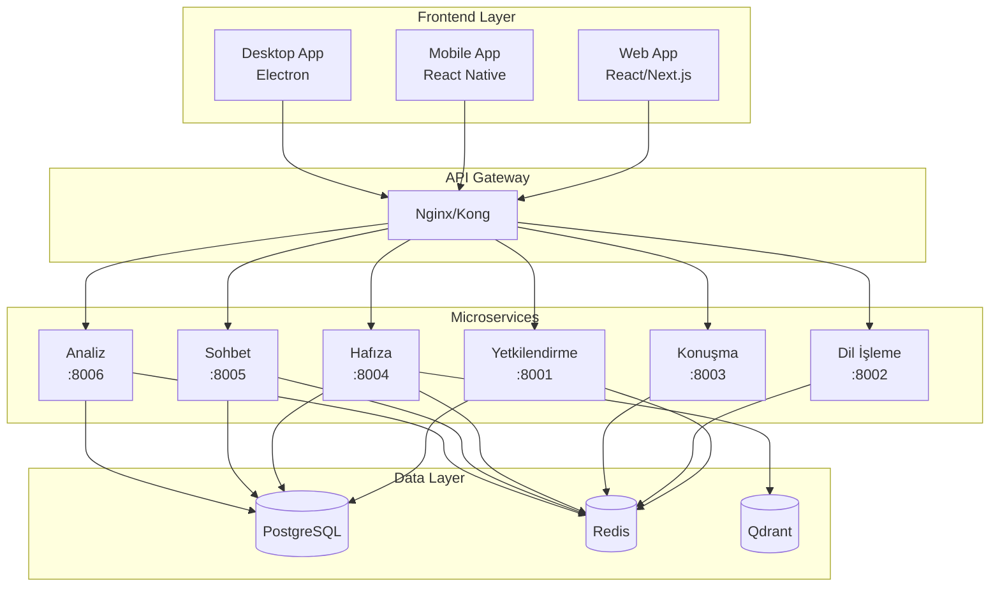

# 🤖 EyAy.OS 2.0 - Modern Turkish AI Assistant Platform

<div align="center">


[](https://opensource.org/licenses/MIT)
[](https://www.python.org/downloads/)
[](https://www.docker.com/)
[](https://kubernetes.io/)

**Modern mikroservis mimarisi ile geliştirilmiş Türkçe AI asistan platformu**

[🚀 Hızlı Başlangıç](#-hızlı-başlangıç) • [📖 Dokümantasyon](#-dokümantasyon) • [🏗️ Mimari](#️-mimari) • [🤝 Katkıda Bulunma](#-katkıda-bulunma)

</div>

## ✨ Özellikler

### 🎯 Temel Yetenekler
- **🇹🇷 Türkçe AI Desteği**: Özel eğitilmiş Türkçe NLP modelleri
- **🗣️ Ses İşleme**: Whisper tabanlı ses tanıma ve TTS sentezi
- **🧠 Akıllı Hafıza**: Vektör tabanlı konuşma hafızası
- **💬 Gerçek Zamanlı Sohbet**: WebSocket ile anlık iletişim
- **📊 Analitik Dashboard**: Kapsamlı kullanım metrikleri

### 🏗️ Teknik Özellikler
- **Mikroservis Mimarisi**: 6 bağımsız, ölçeklenebilir servis
- **Modern Tech Stack**: FastAPI, React, PostgreSQL, Redis, Qdrant
- **Container-Native**: Docker ve Kubernetes desteği
- **API-First**: RESTful API'ler ve GraphQL desteği
- **Cloud-Ready**: AWS, GCP, Azure uyumlu

## 🚀 Hızlı Başlangıç

### Ön Gereksinimler
- Docker 24.0+
- Docker Compose 2.20+
- Python 3.11+
- Node.js 18+

### 1. Repository'yi Klonlayın
```bash
git clone https://github.com/barutseref/EyAy.OS.git
cd EyAy.OS
```

### 2. Geliştirme Ortamını Başlatın
```bash
# Tüm servisleri Docker Compose ile başlat
docker-compose up -d

# Servislerin durumunu kontrol et
docker-compose ps
```

### 3. Sağlık Kontrolü
```bash
# Tüm servislerin çalıştığını doğrula
curl http://localhost:8001/saglik  # Yetkilendirme
curl http://localhost:8002/saglik  # Dil İşleme
curl http://localhost:8003/saglik  # Konuşma
curl http://localhost:8004/saglik  # Hafıza
curl http://localhost:8005/saglik  # Sohbet
curl http://localhost:8006/saglik  # Analiz
```

## 🏗️ Mimari



## 📋 Servis Detayları

| Servis | Port | Açıklama | Teknolojiler |
|--------|------|----------|-------------|
| **Yetkilendirme** | 8001 | JWT tabanlı kimlik doğrulama | FastAPI, SQLAlchemy, PostgreSQL |
| **Dil İşleme** | 8002 | Türkçe NLP ve AI işlemleri | Transformers, spaCy, Hugging Face |
| **Konuşma** | 8003 | Ses tanıma ve sentezi | Whisper, TTS, PyAudio |
| **Hafıza** | 8004 | Konuşma hafızası ve vektör DB | Qdrant, Sentence Transformers |
| **Sohbet** | 8005 | Gerçek zamanlı sohbet | WebSocket, Socket.IO |
| **Analiz** | 8006 | Metrikler ve dashboard | Prometheus, InfluxDB, Pandas |

## 🛠️ Geliştirme

### Yerel Geliştirme Ortamı

```bash
# Belirli bir servisi geliştirmek için
cd hizmetler/yetkilendirme

# Poetry ile bağımlılıkları yükle
poetry install

# Geliştirme sunucusunu başlat
poetry run uvicorn app.main:app --reload --port 8001
```

## 📖 Dokümantasyon

### 📚 Detaylı Rehberler
- [📋 Kapsamlı Kurulum Rehberi](docs/KURULUM_REHBERI.md)
- [🔐 Yetkilendirme Servisi](docs/YETKILENDIRME_SERVISI.md)
- [🧠 Dil İşleme Servisi](docs/DIL_ISLEME_SERVISI.md)
- [🗣️ Konuşma Servisi](docs/KONUSMA_SERVISI.md)
- [💾 Hafıza Servisi](docs/HAFIZA_SERVISI.md)
- [💬 Sohbet Servisi](docs/SOHBET_SERVISI.md)
- [📊 Analiz Servisi](docs/ANALIZ_SERVISI.md)

### 🔗 API Dokümantasyonu
- Yetkilendirme API: http://localhost:8001/docs
- Dil İşleme API: http://localhost:8002/docs
- Konuşma API: http://localhost:8003/docs
- Hafıza API: http://localhost:8004/docs
- Sohbet API: http://localhost:8005/docs
- Analiz API: http://localhost:8006/docs

## 🚀 Production Deployment

### Docker Compose (Basit)
```bash
# Production ortamı için
docker-compose -f docker-compose.prod.yml up -d
```

### Kubernetes (Gelişmiş)
```bash
# Helm ile deployment
helm install eyayos ./infrastructure/helm/eyayos

# Manuel Kubernetes deployment
kubectl apply -f infrastructure/kubernetes/
```

## 📊 Performans

### Benchmark Sonuçları
- **Yanıt Süresi**: < 200ms (ortalama)
- **Throughput**: 1000+ req/sec
- **Eş Zamanlı Kullanıcı**: 10,000+
- **Uptime**: %99.9+

## 🔒 Güvenlik

### Güvenlik Özellikleri
- **JWT Authentication**: Secure token-based auth
- **Rate Limiting**: API abuse protection
- **CORS Protection**: Cross-origin security
- **SQL Injection Protection**: Parameterized queries
- **XSS Protection**: Input sanitization

## 🤝 Katkıda Bulunma

### Katkı Süreci
1. **Fork** yapın
2. **Feature branch** oluşturun (`git checkout -b feature/yeni-ozellik`)
3. **Commit** yapın (`git commit -am 'Yeni özellik eklendi'`)
4. **Push** edin (`git push origin feature/yeni-ozellik`)
5. **Pull Request** oluşturun

### Geliştirme Kuralları
- **Code Style**: Black + Ruff
- **Type Hints**: Zorunlu
- **Tests**: %90+ coverage
- **Documentation**: Docstrings gerekli
- **Commit Messages**: Conventional Commits

## 📈 Roadmap

### 2024 Q4
- [x] Mikroservis mimarisi tasarımı
- [x] Temel AI entegrasyonu planlaması
- [ ] Web arayüzü geliştirme
- [ ] Beta release

### 2025 Q1
- [ ] Mobile uygulama
- [ ] Gelişmiş AI modelleri
- [ ] Multi-tenant support
- [ ] v1.0 release

## 📄 Lisans

Bu proje [MIT Lisansı](LICENSE) altında lisanslanmıştır.

---

<div align="center">

**EyAy.OS ile Türkçe AI'nın geleceğini şekillendirin! 🚀**

[⭐ Star](https://github.com/barutseref/EyAy.OS) • [🐛 Issue](https://github.com/barutseref/EyAy.OS/issues) • [💬 Discussions](https://github.com/barutseref/EyAy.OS/discussions)

</div>
